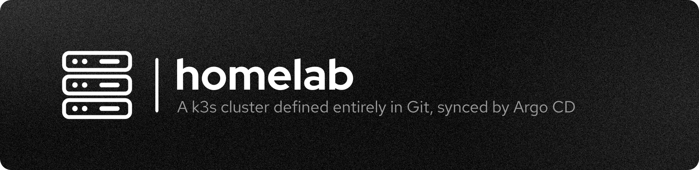

<h1 align="center">
  <br>
  <a href="/"></a>
  <br>
</h1>

<p align="center">
	
	
	
	
	
</p>

<p align="center">
  <a href="#how-it-works">How It Works</a> |
  <a href="#apps">Apps</a> |
  <a href="#repository-layout">Repository Layout</a> |
  <a href="#bootstrap">Bootstrap</a> |
  <a href="#adding-an-app">Adding an App</a> |
  <a href="#secrets">Secrets</a> |
  <a href="#storage--networking">Storage & Networking</a>
</p>

---

The GitOps source of truth for my homelab [k3s](https://k3s.io) cluster. Every
workload that runs on it is a plain [Kustomize](https://kustomize.io) base in
this repo, and [Argo CD](https://argo-cd.readthedocs.io) continuously
reconciles the cluster to match `main`.

Nothing is applied by hand. To change the cluster, you change a YAML file and
push.

## How It Works

```text
git push  ──▶  bootstrap/argocd/root.yaml       (the "app-of-apps")
                 └─ watches bootstrap/argocd/applications/
                      └─ one Argo CD Application per app
                           └─ points at apps/<name>/  ──▶  cluster
```

- **`root.yaml`** is the only thing you apply manually — once. It watches the
  `applications/` folder, so a new app is a new file in that folder.
- Every Application syncs with `prune: true` and `selfHeal: true`. Deleting a
  manifest deletes the resource; editing the cluster by hand gets reverted.
- Apps use `CreateNamespace=true`, so each app owns its own namespace.

## Apps

| App | Namespace | What it is |
| --- | --- | --- |
| [arr-stack](apps/arr-stack) | `arr-stack` | Media automation: qBittorrent, Sonarr, Radarr, Lidarr, Questarr, Scraparr, FlareSolverr behind a Gluetun/ProtonVPN sidecar |
| [cloudflared](apps/cloudflared) | `cloudflared` | Cloudflare Tunnel daemon (2 replicas) — the only way traffic gets in |
| [hermes](apps/hermes) | `hermes` | [Hermes Agent](https://github.com/NousResearch/hermes-agent) + a `signal-cli` sidecar for the Signal channel |
| [homeassistant](apps/homeassistant) | `homeassistant` | Home Assistant |
| [monitoring](apps/monitoring) | `monitoring` | Prometheus, Grafana, Loki, Promtail, node-exporter, kube-state-metrics, NUT exporter |
| [n8n](apps/n8n) | `n8n` | n8n workflow automation |
| [open-webui](apps/open-webui) | `open-webui` | Open WebUI (LLM chat front-end; providers configured in its admin UI) |
| [twenty](apps/twenty) | `twenty` | Twenty CRM + its own Postgres and Redis |

`apps/_template/` is a skeleton, not a deployed app.

## Repository Layout

```text
apps/                        # one directory per app — plain Kustomize bases
  <name>/kustomization.yaml  #   the real Kubernetes resources live here
  _template/                 #   copy this to start a new app
bootstrap/argocd/
  root.yaml                  # app-of-apps — apply once, by hand
  applications/              # one Argo CD Application per app
    _template.yaml.tpl       #   .tpl so the root app never applies it
docs/                        # design notes
.github/media/               # README header + the script that regenerates it
```

## Prerequisites

- A running **k3s** cluster — it ships Traefik and the `local-path` StorageClass,
  both of which the manifests assume.
- **Argo CD** installed in the cluster.
- A **Cloudflare Tunnel** if you want anything reachable from outside the LAN.
- The **SMB CSI driver** + `cifs-utils` on every node, only if you use the
  arr-stack (it mounts a NAS share). See [apps/arr-stack/pvc.yaml](apps/arr-stack/pvc.yaml).

## Bootstrap

```bash
# 1. Install Argo CD (once)
kubectl create namespace argocd
kubectl apply -n argocd -f https://raw.githubusercontent.com/argoproj/argo-cd/stable/manifests/install.yaml

# 2. Point Argo CD at this repo. It deploys everything under apps/ from here on.
kubectl apply -f bootstrap/argocd/root.yaml
```

> [!NOTE]
> If you fork this, change `repoURL` in `bootstrap/argocd/root.yaml` and in every
> file under `bootstrap/argocd/applications/`, and replace the `host:` values in
> each app's `ingress.yaml` with your own domain.

## Adding an App

1. `cp -r apps/_template apps/<name>` and fill in the manifests.
2. `cp bootstrap/argocd/applications/_template.yaml.tpl bootstrap/argocd/applications/<name>.yaml`,
   replace every `<PLACEHOLDER>` (the copy **must** end in `.yaml`).
3. Commit and push. Argo CD picks it up on its own — no `kubectl apply`.

## Secrets

Secrets are **not** in this repo. Each one is created once with `kubectl` and
then referenced by name from the manifests:

```bash
kubectl -n n8n create secret generic n8n-secret \
  --from-literal=N8N_ENCRYPTION_KEY='...'
```

| Secret | Namespace | Used by |
| --- | --- | --- |
| `cloudflared-token` | `cloudflared` | Tunnel token from the Cloudflare Zero Trust dashboard |
| `smb-creds` | `arr-stack` | NAS username/password for the SMB media volume |
| `protonvpn-wg` | `arr-stack` | WireGuard keys for the Gluetun sidecar |
| `scraparr-api-keys` | `arr-stack` | Sonarr/Radarr/Lidarr API keys |
| `grafana-admin-creds` | `monitoring` | Grafana admin login |
| `n8n-secret` | `n8n` | n8n encryption key |
| `open-webui-secret` | `open-webui` | Session signing key (`WEBUI_SECRET_KEY`) |
| `twenty-secret` | `twenty` | Postgres URL/password, app secret, encryption key |
| `hermes-secret` | `hermes` | LLM provider keys, dashboard basic auth, Signal account |

The exact keys each secret needs are documented in the header comment of the
manifest that consumes it.

## Storage & Networking

**Storage.** App config uses `local-path` PVCs, so pods are pinned to whichever
node first scheduled them. The arr-stack media library is the exception: a
statically bound SMB `PersistentVolume` pointing at the NAS.

**Networking.** Every app gets a Traefik `Ingress` (`ingressClassName: traefik`).
Nothing is port-forwarded on the router — `cloudflared` dials out to Cloudflare's
edge, and each public hostname in the tunnel config points back at
`traefik.kube-system.svc.cluster.local:80`. TLS is terminated by Cloudflare.

## Header Image

`.github/media/homelab-header.png` is generated, not hand-drawn:

```bash
./.github/media/generate-header.sh          # needs ImageMagick 7 + the Red Hat fonts
TITLE="something else" ./.github/media/generate-header.sh
```

Adapted from [resend/n8n-nodes-resend](https://github.com/resend/n8n-nodes-resend/tree/main/.github/media).

<p align="center">
  <a href="https://github.com/SilkePilon/homelab">GitHub</a> |
  <a href="https://github.com/SilkePilon/homelab/issues">Issues</a> |
  <a href="https://argo-cd.readthedocs.io">Argo CD Docs</a> |
  <a href="https://docs.k3s.io">k3s Docs</a>
</p>
